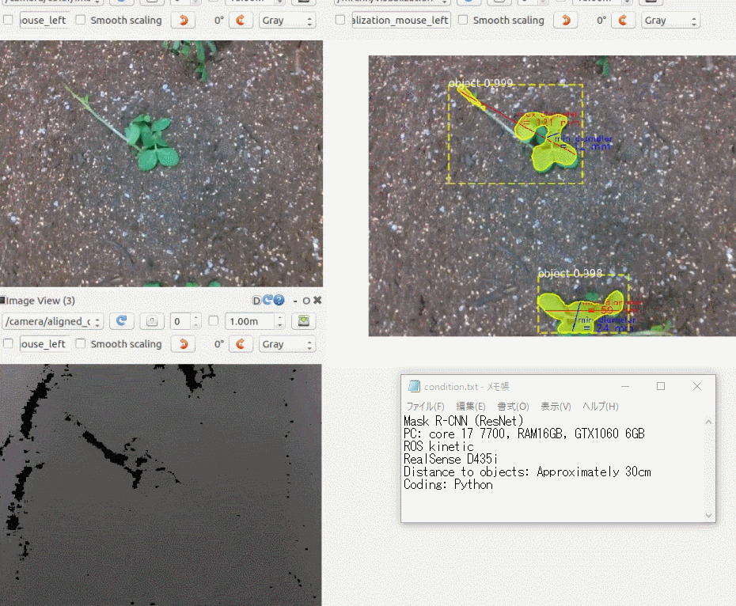
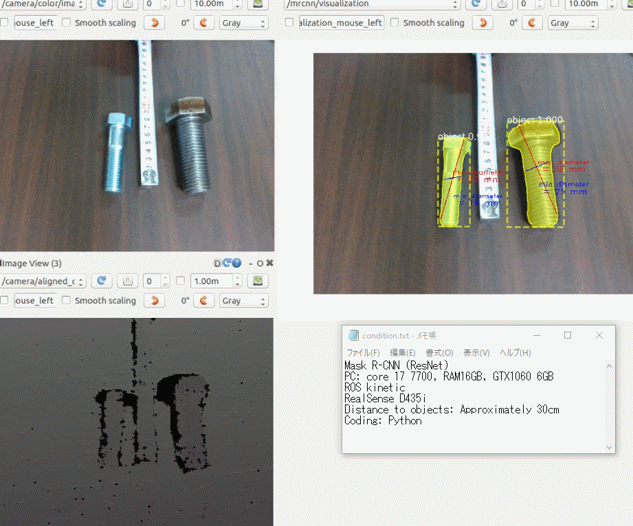
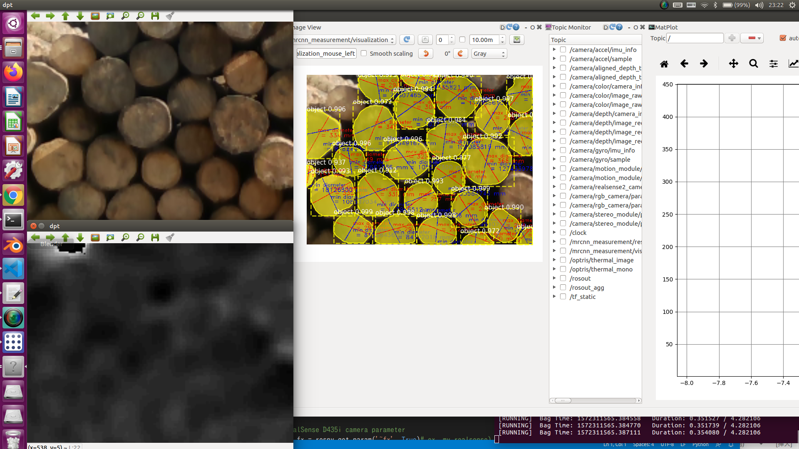
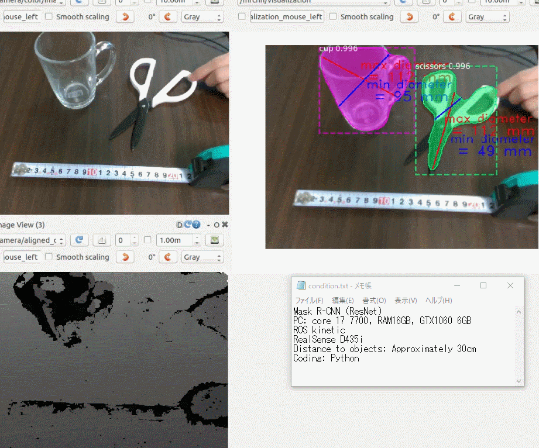

# mrcnn_measurement
Measurement of  max &amp; min diameters of inferenced objects by Mask RCNN
Recommended sensor : RealSense D435
Usage : 
    (0, sh download_files.sh) <= Only first time
    1, roslaunch realsense2_camera rs_aligned_depth.launch
    2, roslaunch mrcnn_measurement mrcnn_measurement.launch
    or
    (0, sh download_files.sh) <= Only first time
    1, roslaunch mrcnn_measurement mrcnn_measurement_rosbag.launch (change <param name="~model" value="mymodel" />)

Sample Results : 

